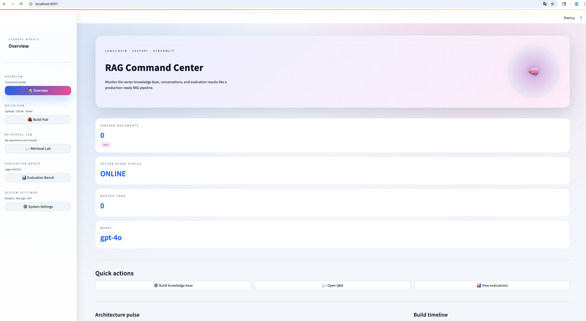

# LangChain RAG Starter Kit

A production-oriented Retrieval-Augmented Generation (RAG) starter built with FastAPI, LangChain, and Streamlit. This template mirrors the design outlined in `designdoc.md` and ships with modular services, multi-vector-store support, evaluation tooling, and Dockerized deployment to help teams bootstrap knowledge-base QA systems quickly.

## Features

- 📄 Document ingestion supporting PDF, DOCX, Markdown, and TXT with configurable chunking strategies
- 🔎 LangChain-based embedding abstraction to swap Azure OpenAI deployments, Sentence Transformers, or BGE families
- 🗃️ Vector store adapters for Chroma (default) and FAISS, with extension hooks for Qdrant/Elasticsearch
- 🔍 Multiple retriever strategies (dense, BM25, hybrid, rerank) and router-friendly RAG chains
- 🤖 FastAPI backend exposing `/build`, `/query`, `/health`
- 💬 Streamlit UI with upload/build, chat QA, settings, and a brand-new evaluation dashboard
- 📊 Automated evaluation scripts powered by ragas metrics (includes dataset generation and batch scheduling)
- 🐳 Docker Compose for one-command local deployment

## Repo Structure

```
backend/
  api/              # FastAPI routers and dependency wiring
  chains/           # LangChain chain templates (standard, compression, mapreduce, router)
  config/           # Settings management and typed config models
  core/             # Shared utilities (logging, storage paths, file helpers)
  models/           # Pydantic request/response schemas
  retrievers/       # Retriever strategy implementations
  services/         # Document processor, embedding, reranker, evaluator services
  vectorstores/     # Adapter interfaces + concrete vector store clients
frontend/
  pages/            # Streamlit multipage app (build, chat, evaluation, settings)
  components/       # Reusable UI widgets
configs/
  config.yaml       # Environment-specific settings
  logging.yaml      # Structured logging config
scripts/
  ingest_sample.py  # Copy sample docs into the upload directory
  evaluate.py       # CLI wrapper for ragas evaluation (JSON + CSV + history)
  generate_eval_dataset.py  # LLM-powered synthetic QA dataset builder
  nightly_eval.py   # Batch/cron-friendly runner for multiple datasets
evaluation/
  datasets/         # Example question/context pairs
  reports/          # Generated metrics and charts
docker/
  Dockerfile.api
  Dockerfile.ui
  docker-compose.yaml
```
1. **Install dependencies**
  ```bash
  python -m venv .venv && .venv\Scripts\activate
  pip install -r requirements.txt
  ```
2. **Configure environment**
  - Copy `configs/config.example.yaml` to `configs/config.yaml`
  - Create a `.env` (or use `.env.example`) with your Azure OpenAI credentials (`AZURE_OPENAI_*`)
  - Adjust vector store paths in `configs/config.yaml` if needed
3. **Run services**
  ```bash
  # Backend
  uuvicorn backend.api.main:app --reload --host 0.0.0.0 --port 8000

  # Frontend (in another shell)
  streamlit run frontend/app.py
  ```
4. **Build a knowledge base**
  - Visit the Streamlit UI → "Build Hub" page
  - Upload docs, tweak chunking, and click Build
5. **Ask questions**
  - Switch to QA page, enter prompts, and inspect retrieved chunks
6. **Evaluate (optional)**
  - Streamlit → "📊 Evaluation" page lets you review the latest metrics, historical trends, and dataset catalog.
  - CLI：
    ```bash
    python scripts/evaluate.py --api http://localhost:8000 --dataset evaluation/datasets/questions.json
    ```
    Reports land in `evaluation/reports/latest.json` and timestamped history files.
7. **Docker Compose (optional)**
   ```bash
   cd docker
   docker compose up --build
   ```
   UI → `http://localhost:8501`, API → `http://localhost:8000`.
8. Screenshot

### Azure OpenAI configuration (required)

1. In `configs/config.yaml`, update the `model` section with your Azure endpoint, API version, and deployment names.
2. In `.env`, populate the secrets (example):
  ```bash
  AZURE_OPENAI_API_KEY=your-key
  AZURE_OPENAI_ENDPOINT=https://your-resource.openai.azure.com
  AZURE_OPENAI_API_VERSION=2024-02-15-preview
  AZURE_OPENAI_CHAT_DEPLOYMENT=gpt-4o
  AZURE_OPENAI_EMBED_DEPLOYMENT=text-embedding-3-large
  ```
3. Restart FastAPI + Streamlit so both the RAG chain and embedding service pick up the Azure credentials.

## Roadmap

- ✅ Repo skeleton & dependency manifest
- 🔄 Implement core RAG pipeline
- 🔄 Add evaluation workflows + reports
- 🔜 Production hardening (auth, observability, multi-tenant storage)

Refer to `designdoc.md` for the full architecture, milestones, and promotional strategy.
